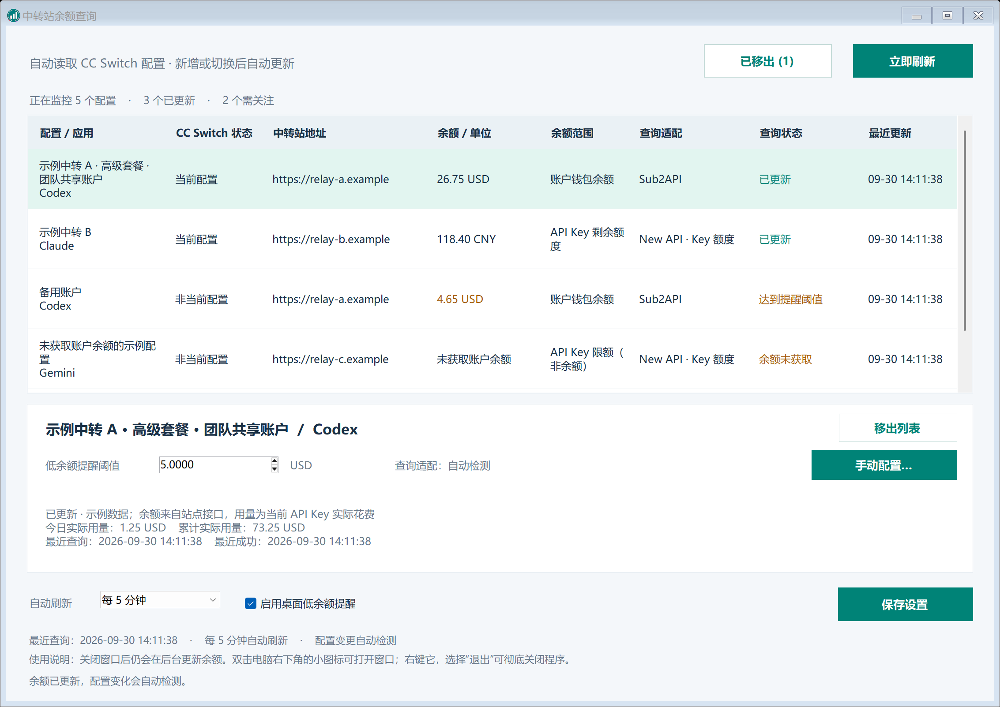
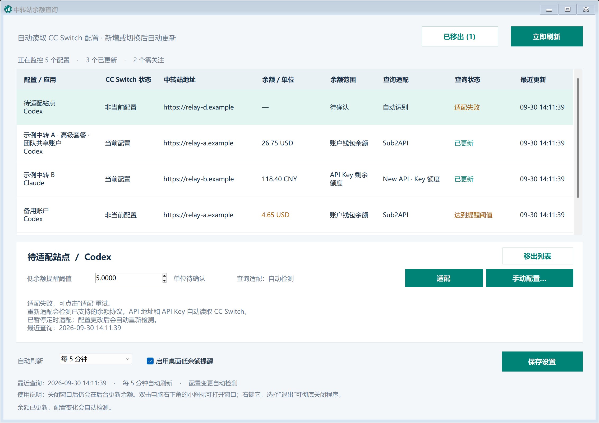

# 中转站余额查询 · Relay Balance Desktop

一个便携的 Windows 桌面余额监控工具。双击 `RelayBalance.exe`，自动读取本机 CC Switch 中的配置，在独立窗口中查看余额、用量及低余额提醒。最小化或关闭窗口后仍在后台更新余额，无需打开 Codex、发起聊天或安装 Node.js。

[下载最新版](https://github.com/LoveIrishCoffee/relay-balance-desktop/releases/latest) · [协议适配说明](docs/ADAPTERS.md)



v1.1.6 新增独立的“CC Switch 状态”列，以“当前配置 / 非当前配置”区分对应应用的当前选择。配置名称统一显示，不再使用绿点或绿色名称；整行浅绿色背景仅表示在本窗口选中了该行。“查询状态”单独表示余额查询结果。



[查看“查询失败”时的重试入口示例](docs/query-retry-preview.png)

## 下载和使用

1. 使用 Windows 10/11 x64，系统需具备 .NET Framework 4.8；先在 CC Switch 中配置站点地址及 API Key。
2. 从 [GitHub Releases](https://github.com/LoveIrishCoffee/relay-balance-desktop/releases/latest) 下载 Windows 发布包，解压后双击 `RelayBalance.exe`。首次启动会在当前用户的本地应用目录释放内置运行时，可能需要几秒钟。
3. 软件每 5 秒检查一次 CC Switch 配置变动。新增、删除、改名、更换 Key 或切换当前配置后，列表自动更新；同一站点的多个配置分别显示，不按品牌或域名合并。
4. 余额默认每 5 分钟查询一次，可改为 10 或 30 分钟，也可点击“立即刷新”。每 5 秒检查配置，不等于每 5 秒请求余额接口。
5. 选中一条配置，可设置其低余额阈值或点击“手动配置…”。手动配置适用于所有选中的配置。修改后点击主窗口中的“保存设置”；桌面提醒开关即时保存。
6. 不想继续监控某条配置时，选中它并点击“移出列表”。移出立即保存，停止后续查询和提醒；从窗口上方的“已移出”入口可以逐项恢复。CC Switch 中的原配置不变。

“CC Switch 状态”读取 CC Switch 对应应用的当前配置标记。不同应用可以同时拥有各自的“当前配置”；“非当前配置”不代表停用或停止监控。在本窗口点击某行只切换查看对象，不会更改 CC Switch 的选择，也不表示正在发送 API 请求。

关闭窗口后继续后台更新余额是当前程序的固定行为，并非勾选项。双击电脑右下角的程序小图标可重新打开窗口；右键它，选择“退出”可彻底关闭程序。如果没看到图标，先点右下角的向上箭头展开隐藏图标。再次打开 EXE 也能恢复已运行的窗口。软件不设置开机自启，重启电脑后需再次打开。

初次查询成功时，若余额已经低于阈值，会提醒一次；持续低余额不会在每次刷新时重复提醒，恢复后再次降到阈值下才重新提醒。Windows 通知设置或勿扰模式可能影响显示。阈值应按该配置显示的货币单位设置；原始额度、无限额度或单位不明的数值不作为货币低余额提醒。

## 能查询哪些站点

程序按 CC Switch 配置和余额接口协议工作，没有品牌白名单或黑名单。能发现配置不代表一定能查询余额。自动识别未成功时显示“适配失败”，认证或网络等查询问题显示“查询失败”；选中失败的配置，点击下方“适配”即可重试。“余额未获取”时，同一位置显示“获取余额”，用于再次查询所选配置。

“适配”只重试所选站点：自动模式重新检测已支持的余额协议；手动模式按已保存的配置重试，不清除字段映射。它遵守站点限流等待时间，不保证识别成功，也不会学习任意接口、调用云端 AI 或执行站点脚本。自动适配失败的配置会暂停周期性探测，“立即刷新”也不会反复探测它；点击“适配”，或更换该配置的 Key、地址、适配方式后，才重新尝试。其他配置的余额仍按设定刷新。有尚未保存的适配修改时，请先保存再点击“适配”。如果提示 Key 无效或没有权限，需要先在 CC Switch 修正凭据。

“手动配置…”是独立的常规功能，选中任意配置都可以打开。你可以根据站点官方接口文档，选择已有适配方式或填写自定义 JSON 映射；反复适配失败时也可自行使用该功能。

在“金额规则”中选择“手动设置单位、除数和余额范围”，即可编辑这三项，不必切换为自定义 JSON。显示余额按接口原始余额数值除以填写的除数计算；New API 使用原始 quota，避免重复换算。手动余额范围会标注“手动指定”，实际用量保留接口报告的单位。选择“按接口自动读取”可恢复站点提供的规则。设置后点击“应用到待保存设置”，再在主窗口点击“保存设置”。

[手动金额规则设置示例](docs/manual-amount-preview.png)

只有“自定义 JSON”需要手填 GET 接口路径与 JSON 余额字段。手动金额规则不会创造缺失的余额，也不会将 Key 未设限额改成账户资金；需要账户查询权限时，仍须具备站点要求的凭据。

手动配置自定义接口需要明确六项：**查询方式、GET 接口路径、JSON 余额字段、单位、换算除数、余额范围（账户／API Key／额度）**。站点地址和 API Key 自动读取 CC Switch，无需再次填写。若接口需要网页登录、Cookie、POST 或额外账户凭据，仅填写字段映射无法完成查询；具体要求见 [协议适配说明](docs/ADAPTERS.md)。

| 适配方式 | 查询范围及限制 |
| --- | --- |
| Sub2API | 读取同站点 `/v1/usage`；按返回内容区分钱包、密钥或订阅／时间窗口额度。 |
| New API · API Key | 查询当前 Key 的可用额度；该额度不一定等于账户总余额。 |
| New API · 账户 | 仅在 CC Switch 已有同源 `usage_script` 配置中包含 `accessToken` 和 `userId` 时可用；软件不执行脚本，也不代为登录。 |
| OpenRouter、DeepSeek | 按官方服务域名识别，使用其余额查询接口。 |
| 自定义 JSON | 使用配置中的 Key，向同源 HTTPS 地址发送 GET，按字段路径、除数和单位读取余额。 |

TokenMetro 没有专用适配，和其他品牌一样按通用协议处理。当前支持最多 1000 条 CC Switch 配置。详细的选择方法和自定义示例见 [ADAPTERS.md](docs/ADAPTERS.md)。

TokenMetro 等 New API 站点的“Key 未设限额”只表示单把密钥没有独立消费上限，账户仍可能余额不足。此时余额栏显示“未获取账户余额”，状态显示“余额未获取”，不会把无限额度、零或兼容接口的大额上限当成钱包余额。显示官网的账户金额需要站点允许账户查询的有效凭据；普通模型 Key、重复适配或仅改字段映射无法增加查询权限。

[账户余额未获取时的界面示例](docs/account-unavailable-preview.png)

“账户余额”“API Key 额度”和“订阅／窗口额度”含义不同，界面会标明来源。New API 缺少可靠换算参数时显示原始 `quota`，不会默认套用固定汇率或将原始额度标成美元。不同货币和不同额度范围不能直接相加。

查询失败不会被当作余额为零：首次失败显示未获取；已有成功记录时可保留上次结果并标注过期，请结合最近成功时间判断。“今日实际用量”和“累计实际用量”仅在接口提供相关字段时展示，不代表所有协议都有这些数据。

## 移出与恢复

任何配置都可以移出，包括正在使用、适配失败或查询失败的配置。移出只影响本工具，不会删除 CC Switch 中的站点、Key 或当前选择，也不清除已保存的阈值与适配规则。重新打开软件后仍保持移出；原配置改名、更换 Key 或地址也不会自动回到列表。使用“已移出”中的“恢复到列表”即可再次查询，仍遵守站点限流。

CC Switch 中已经删除的配置不再出现在“已移出”窗口；用全新配置 ID 重新添加的站点会作为新配置发现。移出与恢复即时保存，不会替你提交尚未保存的阈值或手动适配修改。

[已移出配置的恢复窗口示例](docs/hidden-providers-preview.png)

## 本地数据与隐私

- 默认以 SQLite 只读方式打开 `%USERPROFILE%\.cc-switch\cc-switch.db`，不修改 CC Switch。自定义位置可通过 `CC_SWITCH_DB` 环境变量指定。
- API Key 和查询所需的既有账户凭据只在本机读取，发送至对应配置的同源 HTTPS 查询接口；不上传给本项目，不进行聊天或模型调用。拒绝跨源请求和接口重定向。
- 不执行 CC Switch 自定义脚本，不抓取网页，不自动登录，不收集 Cookie。
- 没有遥测、云端后台或本地 HTTP 监听服务。窗口通过私有标准输入／输出管道与后台进程通信，界面快照不包含密钥。
- 默认设置目录为 `%LOCALAPPDATA%\RelayBalanceDesktop\state`，可用 `RELAY_BALANCE_STATE_DIR` 环境变量覆盖。阈值、刷新间隔、适配规则和已移出的配置 ID 写入 `settings.json`，不保存 API Key。
- 内置运行时和通知偏好位于 `%LOCALAPPDATA%\RelayBalanceDesktop`。退出后可删除 EXE；需清理本地数据时，可再删除该目录及自行指定的设置目录。

提交问题或分享软件时，只提供脱敏后的现象与接口结构。不要上传 CC Switch 数据库、真实响应、密钥、账户令牌或个人应用数据目录。

## 从源码构建

需要 Windows x64、PowerShell 5.1 或更高、.NET Framework C# 编译器及 Node.js 24 x64。没有外部 npm 包依赖。构建会将 Node.js 嵌入 EXE；更换 Node.js 版本时，请同步更新为对应官方发行版的 `NODE-LICENSE.txt`。

```powershell
node --test tests/*.test.mjs
.\build.ps1 -OutputPath .\dist\RelayBalance.exe
```

测试使用虚构凭据、临时数据库和模拟 HTTP 响应，不需要真实账户。GitHub Actions 在 Windows 和 Node.js 24 上运行离线测试、构建和桌面自检。

可进一步运行桌面自检，检查内置运行时、空数据库、设置保存、后台运行与退出、操作按钮遮挡、手动配置窗口及长名称在不同窗口宽度下的显示：

```powershell
$testDirectory = Join-Path $env:TEMP ('relay-balance-test-' + [Guid]::NewGuid().ToString('N'))
$app = Start-Process .\dist\RelayBalance.exe -ArgumentList '--self-test', ('"' + $testDirectory + '"') -WindowStyle Hidden -Wait -PassThru
$app.ExitCode
Get-Content (Join-Path $testDirectory 'desktop-test.json')
```

`--self-test <目录>` 使用指定目录内的测试数据库，不读取真实 CC Switch 或请求真实站点。`--render-preview <目录>` 生成虚构数据的窗口预览，也不查询余额。

`BalanceForm.cs` 负责窗口与托盘，`BackendClient.cs` 负责私有进程通信，`RuntimeBundle.cs` 校验并释放运行时，`desktop-worker.mjs` 负责调度，`core.mjs` 负责读取配置、协议适配和解析结果。

## 分发与许可

项目采用 [MIT 许可证](LICENSE)。内置 Node.js 及其第三方组件的许可全文见 [NODE-LICENSE.txt](NODE-LICENSE.txt)。分享发布包时请保留两份许可证及使用说明；发布包包含 EXE 和对应的 SHA256 校验文件。

当前 Windows 版本未做代码签名，下载后可能显示“未知发布者”或 SmartScreen 提示。仅面向 Windows x64，未提供 macOS、Linux 或 ARM64 桌面版本。站点余额接口和 CC Switch 数据库结构如有变更，可能需要更新适配。
