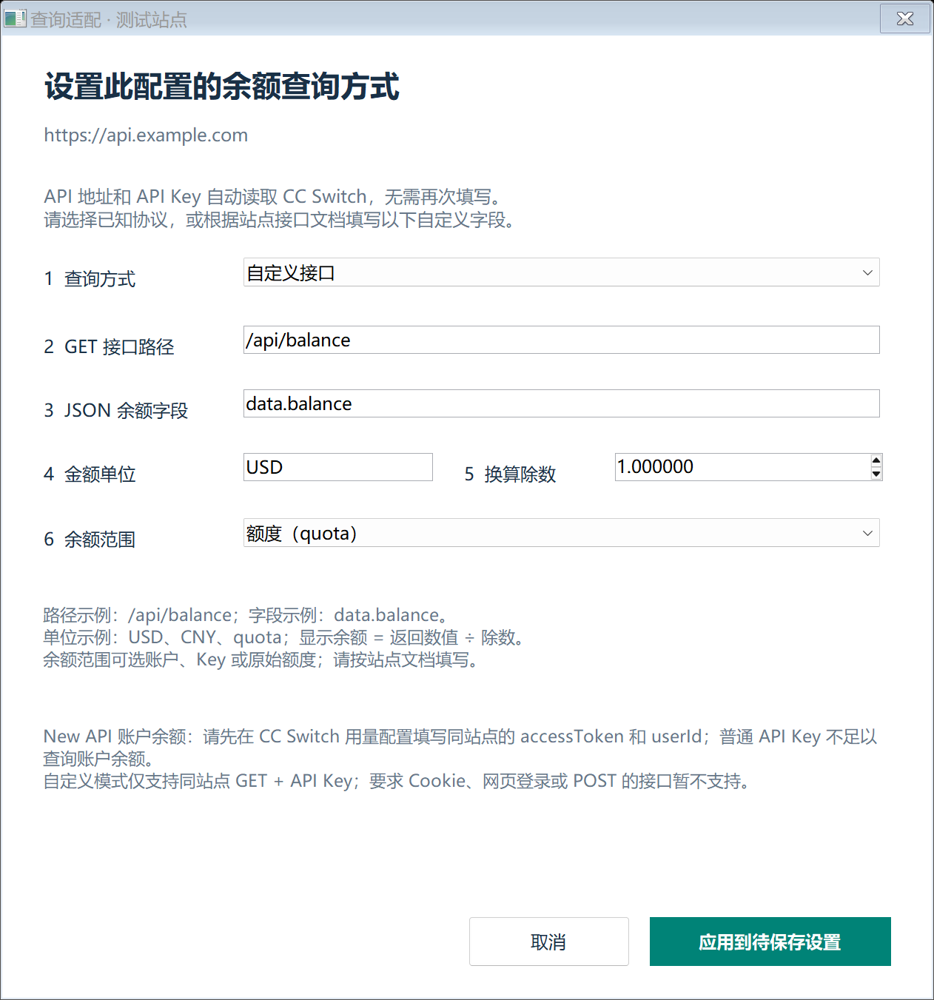

# 余额查询适配说明

软件先从本机 CC Switch 发现配置，再通过余额接口查询。两者独立：配置可以正常显示，但自动识别不到兼容的余额接口时会显示“适配失败”。协议选择适用于当前配置，不会改变 CC Switch 的模型调用设置。

## 配置如何更新

每 5 秒以 SQLite 只读方式检查配置变动；默认每 5 分钟更新余额。每条配置单独显示，同一域名下的多个账户或 Key 不合并。切换 CC Switch 当前配置会更新标记，其他配置仍可参与监控。当前支持最多 1000 条配置。

没有按品牌限制可发现的配置。TokenMetro 没有专用实现，也没有被单独屏蔽；能否查询取决于它当前提供的协议与查询权限。软件无法保证任何采用相似品牌名或界面的站点都使用同一接口。

## 选择适配方式

在主窗口选中任意配置，都可以点击独立的“手动配置…”功能，选择查询方式。点击“应用到待保存设置”后，还需在主窗口点击“保存设置”。只有明确知道站点协议时才手动指定。

自动识别未成功时，状态显示“适配失败”。选中该配置后，点击“适配”即可使用当前站点地址和凭据，再次尝试软件已支持的余额协议。该操作不更改已保存设置，并遵守站点的限流等待时间。

自动适配失败的配置会暂停周期性探测，普通“立即刷新”也不会重新探测它。点击“适配”，或更换该配置的 Key、地址、适配方式后，才重新尝试。其他可查询或临时出错的配置继续按刷新计划处理。存在尚未保存的适配修改时，请先保存，再点击“适配”。

重新适配只重试已支持的协议，不会学习任意网站的接口、调用云端 AI、抓取登录页面或执行脚本，也不保证成功。如果反复显示“适配失败”，你可以从站点官方文档确认查询接口和认证要求，自行使用一直可用的“手动配置…”功能。

| 方式 | 凭据与余额含义 | 适用边界 |
| --- | --- | --- |
| 自动检测 | 使用当前配置已有凭据尝试已知余额协议。 | 不根据品牌名推断未知余额字段，也不保证兼容所有中转站。 |
| Sub2API | 通过同源 `/v1/usage` 查询，解析钱包或额度信息。 | 钱包、Key 和订阅／时间窗口额度分别标注；缺少有效余额字段时显示错误。 |
| New API · API Key | 使用当前 API Key 查询该 Key 的剩余额度。 | Key 可用额度不代表账户钱包总余额；无限额度显示为无限，不当作零余额。 |
| New API · 账户 | 使用 CC Switch 既有同源 `usage_script` 元数据中的 `accessToken` 与 `userId`。 | 必须已有有效账户查询凭据；普通模型调用 Key 不一定有账户查询权限。软件不执行脚本，也不创建登录会话。 |
| OpenRouter | 按官方服务域名识别，读取其积分／余额接口。 | 需要接口允许查询的凭据；转发该服务的其他域名不能仅凭名称认定兼容。 |
| DeepSeek | 按官方服务域名识别，读取其余额接口和返回币种。 | 不将多币种余额直接相加。 |
| 自定义 JSON | 用当前配置的 API Key 向同源 HTTPS 地址发送 GET，读取一个明确的数值字段。 | 只支持下述字段映射；不运行 JavaScript，不自动填表或抓取控制台页面。 |

站点拒绝查询、认证失效、限流、网络失败或协议未知都会单独显示状态。请求失败不会被当作余额为零；保留的上次结果会标注为过期。

## 货币与额度换算

请先看“余额范围”和单位，再解释数值：

- **账户余额**：接口报告的账户或钱包余额。
- **密钥额度**：单个 API Key 的可用额度，可能受独立上限约束。
- **订阅／时间窗口额度**：在套餐或时间窗口内可用的额度，不一定能作为充值余额使用。
- **原始 quota**：站点内部计量单位，不能直接当作美元、人民币或 Token 数量。

New API 只有在接口提供可靠的额度换算参数、币种及所需汇率时才转换显示。缺少这些信息时保留原始 `quota`，不套用常见站点的默认比例。不同货币、账户和额度范围不汇总为一个总余额。

低余额阈值使用当前配置的显示货币单位。原始额度、单位不明或无限额度不会触发货币低余额提醒。今日与累计用量只有接口提供相应信息时才显示，不根据余额变化猜测消费金额。

## 自定义 JSON 映射



站点地址和 API Key 已从 CC Switch 自动读取，无需再次填写。手动配置已有协议时只需选择相应查询方式；选择“自定义 JSON”时，请准备以下六项：

1. **查询方式**：选择自定义 JSON，确认站点支持以 Bearer API Key 认证的 HTTPS GET 查询。
2. **GET 接口路径**：同源站内路径，例如 `/api/balance`。
3. **JSON 余额字段**：点分隔的数值字段路径，例如 `data.balance`。
4. **单位**：站点文档规定的 `CNY`、`USD` 或 `quota` 等单位。
5. **换算除数**：显示数值 = 接口数值 ÷ 此除数；已经是最终单位时填 `1`。
6. **余额范围**：明确数值属于账户余额、API Key 额度还是其他额度。

只有站点的官方文档明确给出余额查询接口、认证方式、字段含义和换算规则时，再使用自定义映射。以下为虚构示例，不对应任何真实服务。

假设站点文档说明：同源 `GET /api/balance` 使用 Bearer API Key，返回以“分”为单位的账户余额：

```json
{
  "data": {
    "balance": 1250
  }
}
```

在适配窗口填写：

| 设置项 | 示例值 | 说明 |
| --- | --- | --- |
| 查询方式 | 自定义 JSON | 读取指定数值字段。 |
| GET 接口路径 | `/api/balance` | 相对于 CC Switch 配置的站点源地址，不填写完整 URL。 |
| 余额字段路径 | `data.balance` | 点分隔的 JSON 对象字段，不是可执行表达式或完整 JSONPath。 |
| 金额单位 | `CNY` | 必须由站点文档确认，填写单位本身不会进行汇率换算。 |
| 数值除以 | `100` | 显示余额 = 返回数值 ÷ 此除数；本例得到 `12.50 CNY`。 |
| 余额范围 | 账户余额 | 按接口文档选择账户、密钥或额度。 |

除数必须大于零。接口路径必须留在配置的 HTTPS 源地址内，不接受跨站 URL、重定向或在 URL 中加入密钥。字段不存在、不是有效数字或响应无法解析时显示失败，不显示为零。

自定义映射不能解决以下接口差异：需要网页登录／Cookie、需要 POST 或额外签名、要求跨站请求、需要执行脚本、需要复杂多字段计算。遇到这些情况，应新增经过审查的协议适配，不要猜测映射。

## 账户登录接口的限制

有些站点的网页控制台用登录 Cookie、账户访问令牌及用户编号查询账户余额。模型调用 API Key 未必拥有这种查询权限。即使公开前端出现 `/api/user/self`、`data.quota` 等名称，也必须确认认证方式、余额范围和换算规则，才能采用相应适配。

选择“New API · 账户”时，需要 CC Switch 既有 `usage_script` 配置提供同源的 `accessToken` 和 `userId`，且该站点兼容此账户查询协议。软件只读取这些既有参数，不执行脚本、不代为登录，也不要求把账户凭据再填入本软件。仅有普通 API Key 时，不能通过修改余额字段路径获得账户查询权限。

如果站点只提供网页登录／Cookie 查询、POST 接口或其他专有认证，请先向站点确认是否有文档化的只读 API Key 余额接口；有兼容的 HTTPS GET 接口时，再依据文档配置。若只有上述登录接口，当前自定义模式不支持，需等待适配实现，或继续从站点控制台查询。不要把 Cookie、账户令牌放入接口路径，也不要用充值或支付接口代替余额查询。

## 环境变量与排查

| 环境变量 | 默认值 | 用途 |
| --- | --- | --- |
| `CC_SWITCH_DB` | `%USERPROFILE%\.cc-switch\cc-switch.db` | 指定 CC Switch SQLite 数据库位置，只读访问。 |
| `RELAY_BALANCE_STATE_DIR` | `%LOCALAPPDATA%\RelayBalanceDesktop\state` | 指定阈值、刷新间隔和适配规则的保存目录。 |

环境变量需要在启动 EXE 前设置。更改后从托盘“退出”再启动，使新进程读取新值。设置文件不包含 API Key，查询凭据仍来自本机 CC Switch。

排查时先核对 CC Switch 中的配置地址、Key 和当前协议，再核对接口权限和单位。提交 GitHub 问题时可提供软件版本、协议名称、错误状态和虚构的响应结构；不要提交数据库、真实 Key、账户令牌、Cookie 或未脱敏的原始响应。
